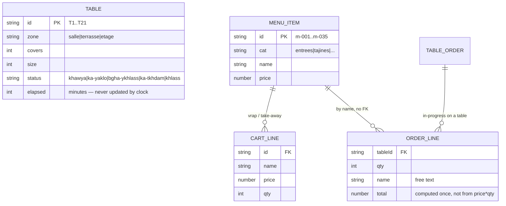

# 01 — Codebase Reconnaissance

## What this repo actually is

A static HTML/CSS/JS marketing-and-demo site. Not an Android app, not a POS, not even a SPA. Every "feature" is a client-side illusion: object literals in `<script>` tags, modal animations, `setTimeout`-driven toasts. Nothing leaves the browser. Nothing persists beyond `localStorage` keys for UI prefs (`kiwiLang`, `kiwiTheme`, `kiwiMode`, `kiwiDateRange`).

The caisse "app" the user wants to ship on Android is one file: [kiwi-caisse.html](kiwi-caisse.html) — 3,147 lines, of which ~1,460 are inline JS and ~1,200 are inline CSS. There is no module system, no test, no type system, no build step, no service worker, no IndexedDB, no API client. The HANDOFF declares this deliberate ("vanilla decision is durable until the first real backend lands"). For investor demos that is fine. For an Android POS that will accept payments from real merchants, **none of this is shippable**. The pivot from "prototype" → "product" has not started.

## Stack (precise)

| Layer | Reality |
|---|---|
| Framework | None. Vanilla DOM. |
| State | Module-scope `let` variables in IIFEs: `cart`, `tableOrders`, `mode`, `selectedId`. |
| Persistence | `localStorage` for prefs only. **Orders, tables, cart, menu, payments — all volatile.** Refresh the tab and the shift is gone. |
| Routing | Multi-page HTML (`index.html`, `dashboard.html`, `kiwi-caisse.html`, `wallet.html`, `brand.html`, `pitch.html`, `business-plan*.html`). No SPA. |
| i18n | [assets/i18n.js](assets/i18n.js:1) — "captured-originals" pattern (FR captured from DOM at load, EN/AR from a `T` dict). **`kiwi-caisse.html` does not participate** in i18n. The caisse is FR/Darija-Arabizi only. RTL is untested. |
| Auth | None. No user, no PIN, no role. The string `"Rachid B. — Caissier"` is hardcoded at [kiwi-caisse.html:1309](kiwi-caisse.html:1309). |
| Payments | `openCardModal()` / `openCashModal()` at [kiwi-caisse.html:2386](kiwi-caisse.html:2386) and [:2482](kiwi-caisse.html:2482) — animations only. No PSP, no terminal, no tokenization. |
| Hardware | None. No print driver, no cash drawer, no scanner, no reader. |
| Offline | None. The "Live" dot at [:1280](kiwi-caisse.html:1280) is decorative. |
| Build/test/CI | None. |
| Backend | None. There is no server-side code anywhere in the repo. |

## Files that matter to caisse

- [kiwi-caisse.html](kiwi-caisse.html) — the entire app.
- [assets/tokens.css](assets/tokens.css) — brand tokens (not imported by caisse; caisse re-declares them inline at [:18](kiwi-caisse.html:18)).
- [assets/interactive.js](assets/interactive.js), [assets/pages.js](assets/pages.js), [assets/features.js](assets/features.js), [assets/pages-pro.js](assets/pages-pro.js) — power the **dashboard**, not the caisse. Caisse re-implements modals from scratch.

Everything else (`business-plan*.html`, `pitch.html`, `wallet.html`, `brand.html`, `Kiwi-Brand-Identity.html`) is investor-facing material, not product surface.

## Current "data model" (such as it exists)

What's missing from this model is the entire business:
- No `merchant`, `location`, `user`, `shift`, `device`.
- No `payment`, `tender`, `refund`, `void`, `discount`, `tip`, `tax_line`, `receipt`.
- No `modifier`, `modifier_group`, `combo`, `course`, `seat`.
- No `ingredient`, `recipe`, `stock_movement`, `supplier`, `purchase_order`.
- No `customer`, `loyalty_account`, `reservation`.
- No `audit_log`, `event`.
- Order lines reference menu items **by name string**, not id. The two menus (the 12-item dine-in `menu` at [:1764](kiwi-caisse.html:1764) and the 35-item `menuItems` at [:2078](kiwi-caisse.html:2078)) are not unified.

## Routes and surfaces

The caisse single page renders two modes from one DOM tree, switched by `setMode()` at [kiwi-caisse.html:1863](kiwi-caisse.html:1863):

| Mode | Surface | Status |
|---|---|---|
| `salle` | Floor plan (21 tables, 3 zones) → right-panel order detail → split-bill modal. | Prototype-grade. Visually polished. |
| `vrap` | Category pills + menu grid + cart + cash/card modals. | Prototype-grade. |
| `order` (sub-mode) | Open an empty table, build an order from the menu grid. | Recently added (commit `87bcacf`). Prototype-grade. |

## What is production-quality, what is prototype, what is missing

**Production-quality (UX/visual only):**
- Brand system, type stack, color tokens. [assets/tokens.css](assets/tokens.css).
- Floor-plan visual language (status colors, chair glyphs, zone counts) — genuinely well-considered.
- Split-bill UX flow (equal parts / per-item / per-amount with running totals) at [kiwi-caisse.html:2803](kiwi-caisse.html:2803) — better than what most Moroccan competitors ship.

**Prototype-grade:**
- Order entry, cart, table state machine. Logic works for the happy path; collapses under any edge case (refresh, two cashiers, network loss, partial payment, refund).
- The five-state table status enum (`khawya`/`ka-yaklo`/`bgha-ykhlass`/`ka-tkhdam`/`khlass`) is a good vocabulary but transitions are implicit and scattered across DOM handlers, not modeled as a state machine.

**Missing entirely:**
- Persistence of any kind.
- Multi-user / multi-device / multi-terminal.
- Authentication, authorization, manager override.
- Payments rail (CMI, SoftPOS, QR, wallet).
- Hardware abstraction (printer, drawer, scanner, reader, KDS).
- Offline mode and sync.
- Backend, API, database, event bus.
- Inventory, recipes, COGS.
- KDS as a separate surface.
- Reporting beyond a static "27 512 MAD" placeholder at [:1331](kiwi-caisse.html:1331).
- Tax engine (TVA 10%/20%, fiscal invoice numbering).
- Receipts (paper, email, SMS, WhatsApp).
- Refund / void / discount flow with reason codes.
- Shift open/close, cash drawer reconciliation, blind close.
- Audit log.
- Tests at any level.
- Observability, error reporting, crash analytics.
- Arabic, RTL, hijri.
- Android packaging (Capacitor/TWA/Compose Multiplatform/Flutter — no decision made).

## Bottom line for Pass 1

The current caisse is a **convincing screenshot that moves**. It demonstrates taste and is a credible artifact for a seed conversation. As an Android POS for paying merchants, it is **0% built**: there is no backend, no payments rail, no persistence, no auth, no hardware integration, no offline sync, no test, no observability. The Pass-2 gap matrix scores this honestly.
