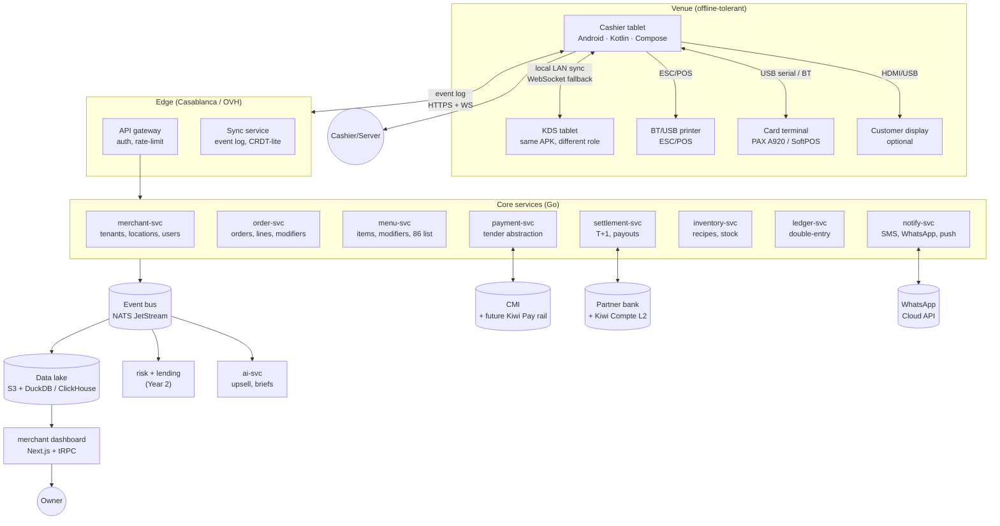

# 04 — Architectural Verdict and 12-Month Roadmap

## Verdict: not salvageable as a product, fully salvageable as a design artifact

The current caisse is a **single-file HTML mock**. There is no architecture to salvage and no architecture to migrate from — there is a 3,147-line file with no backend. The right framing is not "rewrite vs. evolve." The right framing is: **the production codebase has not been started**, and the prototype is a high-quality visual + interaction spec that the production team should build *from*, not extend *into*.

Concretely:

- **Keep** [kiwi-caisse.html](kiwi-caisse.html) as the canonical UX spec for the floor-plan view, split-bill modal, table state vocabulary, color/type system. It is a better-than-Figma reference.
- **Throw away** every line of JS state in that file. None of it is structured for multi-user, multi-device, persistence, or sync.
- **Do not pick** "vanilla JS in a WebView" as the production Android architecture. HANDOFF's "vanilla forever until backend lands" rule is correct for the demo but **must not survive contact with paying merchants**. Vanilla DOM in a Capacitor shell will lose against Square's native Android on every dimension that matters (printer reliability, BLE pairing, EMV kernel performance, cold-start time, battery, crash recovery).

### Migration path that does not pause the business

The "business" today is investor and design-partner conversations powered by static demos. The migration is therefore not "live-traffic cutover" but "build the real thing in parallel while the marketing site keeps demoing."

1. **Freeze** `kiwi-caisse.html` as the design spec. Stop adding logic to it.
2. **Stand up** a new repo: `kiwi-pos-android` (native Kotlin + Jetpack Compose) and `kiwi-platform` (Go or TypeScript backend, decision below).
3. **Reuse** brand tokens by exporting [assets/tokens.css](assets/tokens.css) as a Compose `MaterialTheme` + a Tailwind preset for the future merchant web app.
4. **Demo continuity:** continue to demo the HTML for sales/investors for another 6 months. New product is invisible to the outside until pilot.

---

## Target architecture

### Component decisions and the rationale

| Component | Choice | Why |
|---|---|---|
| Mobile client | **Native Android (Kotlin + Compose)** | EMV kernel, USB serial, BT printer reliability, ESC/POS, MPoC SoftPOS — all require native. WebView/Capacitor will fail certification or fail in the field. |
| Local store | **SQLite (Room)** | Offline-first. Survives kill/restart. WAL mode for concurrent reads while sync writes. |
| Sync protocol | **Append-only event log**, server-assigned `lsn`, client-assigned `(device_id, seq)` for offline writes. | True CRDT is overkill for POS — orders are append-mostly and conflicts are rare and resolvable by business rules (last-writer-wins on `order_line.qty`, additive on `payment`). |
| Backend language | **Go** | Boring, fast, type-safe, dominant in payments backends (Stripe, Adyen Edge, PayPal, Shopify Edge). The team should not pick Node for a settlement engine in 2026. |
| API | **gRPC internally + HTTPS/JSON edge** | The mobile app talks HTTPS/JSON; services talk gRPC for back-pressure and code-gen. |
| Event bus | **NATS JetStream** | Cheaper and simpler than Kafka at our scale, with durable streams and exactly-once-ish delivery. Reassess at 10k merchants. |
| Datastore | **Postgres per service** + Outbox pattern → NATS → ClickHouse for analytics | Standard. No exotic choices. |
| Hosting | **OVH Casa (or AWS af-south-1 + Moroccan affiliate)** | Data residency for cardholder-adjacent data. Decide before payments rail goes live; migration cost later is 6+ months. |
| Auth | **OIDC + per-merchant PIN + manager PIN + biometric on Android** | Phone-PIN is the dominant pattern for cashiers globally. Biometric for managers. |
| Observability | **OpenTelemetry → Grafana + Loki + Tempo + Sentry for crash + a real on-call rotation** | Day-one. Not a "later" item. |
| CI/CD | **GitHub Actions + signed APK + staged rollout via Play Console** | Standard. |

### Non-negotiable engineering bar before onboarding paying merchants

These are gates, not aspirations. Until each is true, do not take a paying merchant's money.

1. **SLOs.** 99.9% available at the API edge (43 min/month). p95 order-write < 300 ms online, < 80 ms offline. Card auth p95 < 4 s including terminal round-trip.
2. **Error budget enforced.** If breached, feature work stops, reliability work resumes. Written rule, not aspiration.
3. **On-call.** Two-person follow-the-sun (founder + first engineer until headcount grows). Pager response < 10 min in business hours, < 30 min off-hours.
4. **Backups.** Postgres PITR with verified restore weekly. Cardholder-adjacent backups encrypted with merchant-scoped keys.
5. **Security review.** Independent pentest before pilot, annually thereafter. ASVS L2 minimum. CMI's own certification process is the gate for the payment terminal integration.
6. **PCI scope minimization.** **No PAN in our backend, ever.** Use the terminal's kernel or SoftPOS-vendor SDK; persist only network tokens, `last4`, `brand`, `auth_code`, `acquirer_ref`. Targeting PCI SAQ B-IP, not Level 1.
7. **Data classification.** `public / merchant / cardholder-adjacent / pii`. Cardholder-adjacent stays in Moroccan region; pii in Morocco-tier hosting.
8. **Audit log.** Every void, refund, discount, role change, settlement decision recorded with `actor_id`, `terminal_id`, `prev_hash` (tamper-evident chain).
9. **Idempotency everywhere.** Every state-mutating API requires `Idempotency-Key`. Settlement engine is doubly idempotent.
10. **Disaster runbook.** "Casablanca DC is down, what does a venue do?" → offline mode keeps service for 24h, settlement is delayed, cash works. Tested quarterly.

---

## 12-month roadmap

Each quarter is a **theme that moves at least one $1B lever**, not a feature checklist.

### Q1 2026 (now → Aug) — "Foundation that can take a card"

**Theme:** Stand up the production stack and prove one merchant can take one real card payment, end-to-end, including settlement reconciliation.

- New repos, Android client skeleton, Go backend skeleton, OVH Casa hosting, OpenTelemetry from day one.
- Multi-tenant data model: `merchant`, `location`, `user`, `terminal`, `shift`, `order`, `order_line`, `payment`, `ledger_entry`.
- Local SQLite + offline event log + edge sync service. Survive 24h offline.
- **CMI on PAX A920** end-to-end. One terminal, one café, one tajine, one card.
- Daily settlement file ingestion, payout to merchant IBAN, exception queue.
- Lever moved: **Lever 1 (acquiring) — the only one that matters this quarter.**

**Gate to Q2:** one design-partner café in Tanger has been running on Kiwi for 4 weeks with > 1,000 card transactions and zero unresolved settlement variances.

---

### Q2 2026 (Sep → Nov) — "A real café actually runs on Kiwi"

**Theme:** Close every operational gap that prevents a café from replacing its existing till and CMI relationship with Kiwi. Move from 1 merchant to 25.

- Menu engineering + modifiers + 86-list + availability windows.
- KDS surface (same APK, role-switched).
- Multi-station printing (kitchen + receipt) over BT.
- Bill split fully wired (we already have the UX spec).
- Shift open/close + blind cash close + cash drawer reconciliation.
- Void / refund / manager PIN.
- WhatsApp receipt + email receipt.
- TVA engine + DGI-compliant invoice numbering.
- Arabic + RTL pass on caisse.
- Lever moved: still **Lever 1**, plus the *substrate* for Levers 2/6/8 (the event log starts generating data).

**Gate to Q3:** 25 merchants live, 3 of them ≥ 8 weeks of clean operation, net MRR ≥ 30k MAD, support tickets per merchant trending down month-over-month.

---

### Q3 2026 (Dec → Feb) — "The flywheel inputs come online"

**Theme:** Ship the products that need 6 months of merchant data behind them — and the consumer-side surfaces that the acquiring deal funded.

- Inventory v1: recipes, ingredient depletion on `order.completed`, 86-list automation, supplier list (no purchase orders yet).
- Pay-at-table via QR (consumer pays without staff intervention).
- Daily WhatsApp brief to owners (first AI surface — Lever 8).
- Loyalty v1: stamp card → WhatsApp.
- Merchant dashboard web app (Next.js): revenue, settlement, refunds, shift exports.
- Multi-location for the chain customers we'll have hit by now.
- Lever moved: **Lever 8 (AI), substrate for Lever 2 (lending data), Lever 4 (consumer touchpoints).**

**Gate to Q4:** 100 merchants live, total processed GMV ≥ 50M MAD/mo, ≥ 30 merchants with 12+ weeks of clean data → underwriteable for cash advance.

---

### Q4 2026 (Mar → May) — "Money moves in both directions"

**Theme:** Ship the first non-SaaS revenue line that uses the data substrate we've built.

- **Kiwi Capital v1** (Lever 2): partner with one Moroccan financing company, Murabaha-structured advance, 50-merchant pilot, daily-split repayment from settlement.
- Online ordering: own-branded per-merchant ordering page, Glovo/Jahez menu-sync inbound.
- Tip pooling + payroll-export v0 (Lever 3 stub).
- BaaS license/partnership path locked (Lever 7 — strategic milestone, not product launch).
- Lever moved: **Lever 2 (lending) live; Lever 3 (payroll) and Lever 7 (BaaS) on rails.**

**Gate to FY27:** 250 merchants live, capital book ≥ 5M MAD outstanding with default rate < 4%, ≥ 1 chain customer (5+ locations) signed, BaaS partnership signed.

---

## What goes wrong if we miss this roadmap

- **Slipping Q1 by 3 months** = no merchant data for AI/lending substrate; competitor (a CMI-friendly fintech or Loyverse Morocco distributor) takes the field.
- **Skipping the non-negotiable bar to chase merchants** = first chargeback storm or first multi-day outage destroys reputation; Morocco is a small market, word travels.
- **Building consumer wallet (Lever 4) before merchant base** = the most common death of two-sided plays. Do not start that work before Q3.

## The single most important sequencing decision

**Lever 1 in Q1. Everything else is downstream of acquiring being live.** If only one engineering goal exists in 2026, it is that one merchant can swipe one card on Kiwi and have the money in their IBAN tomorrow morning, reconciled, recoverable, refundable.
